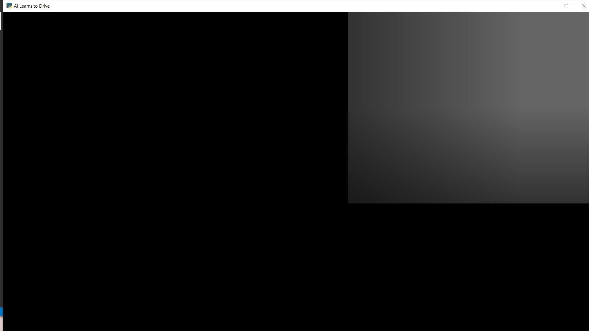

# Car-QLearning

Ensure you are using tensorflow version 2 before trying this: https://gist.github.com/off99555/fd59f204c02b5f704287227d67744d6f

`pip install -r requirements.txt`
`python main.py`

For handling eager exection:
<https://stackoverflow.com/questions/56561734/runtimeerror-tf-placeholder-is-not-compatible-with-eager-execution>

code used to convert to tensorflow v2: https://www.tensorflow.org/guide/upgrade

However currently it doesn't run still:
